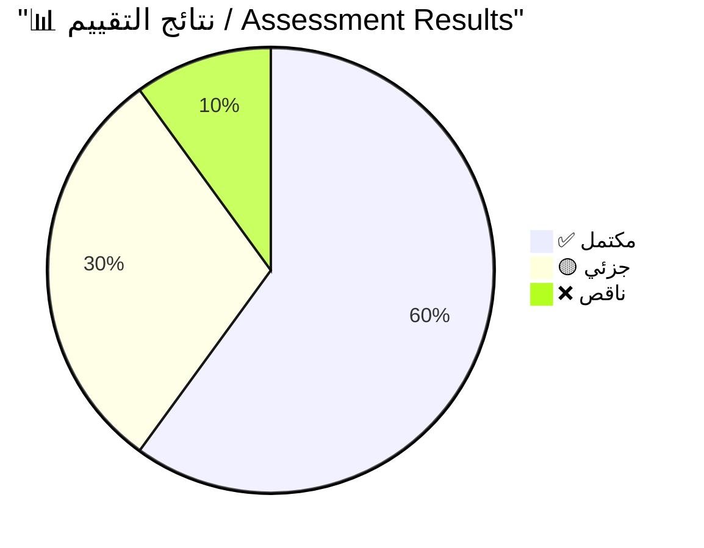
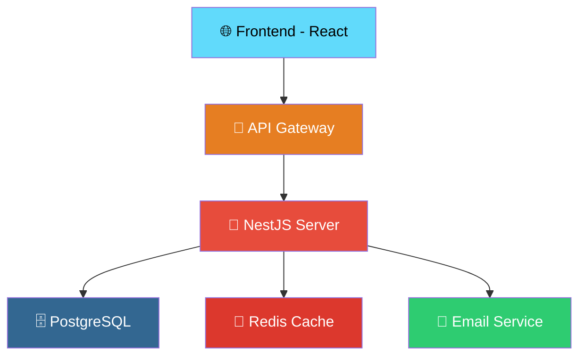

# 📋 قاعدة كتابة التقارير التقنية / Technical Report Writing Rule

> **الهدف:** توحيد أسلوب كتابة التقارير التقنية لتكون مهنية، منظمة، وقابلة للعرض بـ Preview المضمن في Antigravity.

---

## 1. 📦 بنية الملف وصيغته / File Structure & Format

### ⚠️ الحدود القصوى / Size Limits

> [!CAUTION]
> **حدود صارمة لكل ملف تقرير:**
> - 📏 **الحد الأقصى للسطور:** `2500 سطر` لكل ملف
> - 💾 **الحد الأقصى للحجم:** `1 MB` (1,048,576 بايت) لكل ملف
> - إذا تجاوز المحتوى أياً من هذين الحدين → **قسّمه إلى أجزاء** (انظر قسم التقسيم أدناه)

### 📂 مجلد التخزين المخصص / Dedicated Storage Folder

> [!IMPORTANT]
> **جميع التقارير التقنية** يجب أن تُخزن في مجلد فرعي `reports/` داخل مجلد الـ Artifacts:
> ```
> brain/{conversation-id}/
> └── reports/
>     ├── {name}.md                    ← التقرير الأساسي (Artifact)
>     ├── {name}.md.metadata.json      ← البيانات الوصفية
>     └── {name}.md.resolved           ← نسخة Preview
> ```
> هذا يسهّل تتبع التقارير وفصلها عن الشروحات والملفات الأخرى.

### الملفات المطلوبة عند إنشاء تقرير:
| الملف | الغرض | المسار | مثال |
|-------|--------|--------|------|
| `{name}.md` | ✅ التقرير الأساسي — يُكتب كـ Artifact | `reports/{name}.md` | `reports/readiness-report.md` |
| `{name}.md.metadata.json` | 📋 بيانات وصفية للتقرير | `reports/{name}.md.metadata.json` | `reports/readiness-report.md.metadata.json` |
| `{name}.md.resolved` | 🔄 النسخة القابلة للعرض بـ Preview | `reports/{name}.md.resolved` | `reports/readiness-report.md.resolved` |

### قواعد إنشاء الملفات:
- **الملف الأساسي** → Artifact بنوع `"other"` أو `"walkthrough"` حسب السياق
- **ملف `.md.metadata.json`** يحتوي على:
  ```json
  {
    "artifactType": "ARTIFACT_TYPE_WALKTHROUGH",
    "summary": "ملخص مهني للتقرير يشمل النتائج والتوصيات الرئيسية...",
    "updatedAt": "ISO-8601 timestamp",
    "requestFeedback": true
  }
  ```
- **ملف `.md.resolved`** → نسخة مطابقة للملف الأساسي لتمكين Preview

### 📐 استراتيجية التقسيم عند تجاوز الحدود / Splitting Strategy

إذا تجاوز التقرير **2500 سطر** أو **1 MB**، قسّمه كالتالي:

```
reports/
├── readiness-assessment/              ← مجلد فرعي للتقرير
│   ├── 00-summary.md                  ← الملخص التنفيذي + فهرس الأجزاء
│   ├── 00-summary.md.metadata.json
│   ├── 00-summary.md.resolved
│   ├── 01-findings.md                 ← قسم النتائج
│   ├── 01-findings.md.metadata.json
│   ├── 01-findings.md.resolved
│   ├── 02-analysis.md                 ← قسم التحليل
│   ├── 02-analysis.md.metadata.json
│   ├── 02-analysis.md.resolved
│   └── 03-recommendations.md          ← قسم التوصيات
```

**ملف الملخص (`00-summary.md`) يجب أن يتضمن:**
- الملخص التنفيذي الكامل
- فهرس بروابط لجميع الأجزاء
- جدول حالة مختصر لكل قسم
- عدد الأسطر الإجمالي لجميع الأجزاء

---

## 2. 📐 الهيكل العام للتقرير / Report Structure

### كل تقرير يجب أن يتبع هذا الهيكل:

```markdown
# 📋 [عنوان التقرير بالعربي]
# [Report Title in English]

> **التاريخ:** YYYY-MM-DD
> **المُعد:** Antigravity AI Assistant
> **المشروع:** [اسم المشروع / Project Name]
> **الحالة:** 🟢 مكتمل | 🟡 قيد المراجعة | 🔴 يحتاج تحديث

---

## 📑 فهرس المحتويات / Table of Contents
1. [الملخص التنفيذي](#)
2. [المقدمة](#)
3. [المنهجية](#)
4. [النتائج](#)
5. [التحليل](#)
6. [التوصيات](#)
7. [الملخص والخطوات التالية](#)
8. [المراجع](#)

---

## 1. 📌 الملخص التنفيذي / Executive Summary
(فقرة واحدة تلخص كل التقرير)

## 2. 🎯 المقدمة / Introduction  
(السياق والهدف)

## 3. 🔬 المنهجية / Methodology
(كيف تم التحليل)

## 4. 📊 النتائج / Findings
(البيانات والملاحظات)

## 5. 🔍 التحليل / Analysis
(تفسير النتائج)

## 6. 💡 التوصيات / Recommendations
(خطوات عملية)

## 7. 📝 الملخص / Summary
(خلاصة وخطوات تالية)

## 8. 📚 المراجع / References
(روابط ومصادر)
```

---

## 3. 🌍 التعامل مع تداخل اللغتين العربية والإنجليزية وفصل الأكواد / Bilingual Handling & Code Isolation

### أ. فصل الأكواد عن النصوص / Isolation of Code Blocks
- **يُمنع منعاً باتاً** كتابة كود برمجي طويل أو استدعاء دوال برمجية معقدة في نفس سطر النص العربي داخل التقارير الفنية.
- يجب وضع أي كود برمجي أو مقارنة بين كودين أو استعلام في كتلة كود منفصلة (Fenced Code Block) مع تحديد لغة البرمجة أو التقنية المستعملة (مثل `typescript` أو `sql` أو `json`).
- يُسَمّح فقط بكتابة أسماء المتغيرات البسيطة والمصطلحات البرمجية كـ `inline code` (مثل `id` أو `status`) بشرط ألا تؤثر على تدفق وسلاسة السطر العربي.

### ب. استخدام صناديق التنبيه الإلزامية / Mandatory Alert Boxes
يتم استخدام هذه الصناديق بشكل إلزامي في جميع التقارير التقنية لتصنيف البيانات وتسهيل قراءتها وتفادي فوضى التنسيق وتداخل النصوص ثنائية اللغة:

| نوع الصندوق / Box Type | الاستخدام في التقارير (عام لكل الأنظمة) / Report Usage (General) |
| :--- | :--- |
| **`> [!NOTE]`** | **شرح وتوضيح عام:** يُستخدم لشرح فكرة عامة، أو توضيح منطق عمل كود معين ذُكر بالتقرير، أو تقديم خلفية مبسطة عن موضوع التحليل والتقييم. |
| **`> [!TIP]`** | **التوصيات والنصائح:** يُستخدم لعرض أفكار تحسين الأداء (Optimizations)، أو اقتراح أسلوب تطوير أفضل وأكثر فاعلية، أو تقديم نصائح عامة للمؤسسة والمطورين. |
| **`> [!IMPORTANT]`** | **التغييرات والقرارات الجوهرية:** يُسخدم لشرح التغييرات الجوهرية في المنطق الحسابي والمالي، أو قرارات البنية التحتية، أو تعديلات قواعد البيانات الإجبارية التي لا يمكن إغفالها. |
| **`> [!WARNING]`** | **العيوب والملاحظات الفنية:** يُستخدم للتنبيه لوجود ثغرات أو أخطاء برمجية خفية (Bugs)، أو تحذيرات حول أخطاء الحسابات والتقارير والخصومات، أو ديون تقنية (Technical Debt) تحتاج معالجة. |
| **`> [!CAUTION]`** | **المخاطر العالية والأعطال:** يُسخدم للتحذير من أخطاء فادحة وقت التشغيل (Runtime Errors)، أو كود يهدد استقرار التطبيق والخدمة (Crashes)، أو تغييرات تكسر التوافقية السابقة (Breaking Changes). |

### ج. قواعد الكتابة والمصطلحات التقنية في التقارير / Terminology & General Rules:
- **العناوين:** يجب أن تكون ثنائية اللغة دائماً مثل: `## 📊 النتائج / Findings`
- **الفقرات:** عربي أولاً، ثم إنجليزي لضمان سهولة الفهم.
- **المصطلحات الفنية وسط النص العربي:** عند ذكر مصطلح تقني وسط نص عربي، اكتبه كـ `inline code` واتبعه بالشرح المختصر بين قوسين لتفادي التداخل، مثل: `Multi-Tenancy` (تعدد المستأجرين — عزل بيانات كل جهة أو مستخدم بشكل مستقل).

**أمثلة عامة للتطبيق في التقارير الفنية:**

```markdown
> [!NOTE]
> **ما هو نظام أمان مستوى الصف (Row-Level Security - RLS)؟**
> هو آلية أمان متقدمة في قواعد البيانات تمنع أي مستخدم أو جلسة اتصال من الاستعلام عن بيانات لا تخصه بشكل تلقائي على مستوى خادم قاعدة البيانات، مما يضمن عزل البيانات بشكل كامل حتى في حال وجود أخطاء في الكود البرمجي للتطبيق.

> [!TIP]
> **تحسين استعلامات قواعد البيانات (Query Optimization):**
> يُنصح بإضافة فهارس (Indexes) على الأعمدة الأكثر استخداماً في عمليات البحث والتصفية (Filtering) لتقليص زمن الاستجابة إلى أجزاء من الثانية.

> [!IMPORTANT]
> **تعديل جوهري في بنية الجداول:**
> تم تحديث حقل البريد الإلكتروني في جدول الحسابات ليكون فريداً (Unique Constraint) لمنع تسجيل حسابين بنفس البريد الإلكتروني في نفس الوقت.

> [!WARNING]
> **ملاحظة حول أداء النظام:**
> تم رصد تأخر في استجابة بوابة الدفع بسبب استدعاءات متزامنة وغير محسنة لطلب رمز الوصول (Access Token)، مما يتطلب استخدام آلية الكاش (Caching) لحفظ الرمز طوال فترة صلاحيته.

> [!CAUTION]
> **خطر أمني حول الجلسات والرموز:**
> نسيان تحديد تاريخ انتهاء صلاحية (Expiration Time) لرموز المصادقة قد يؤدي إلى بقائها نشطة للأبد، مما يسهل اختراق الحسابات في حال تسريب الرمز.
```

---


## 4. 📊 الرسوم التوضيحية في التقارير / Diagrams

### أنواع المخططات المناسبة للتقارير:

| نوع المخطط | الاستخدام في التقارير | مثال |
|------------|----------------------|------|
| `graph TD` | هيكلية النظام أو العمارة | بنية التطبيق |
| `graph LR` | تدفق العمليات | مسار الطلب |
| `sequenceDiagram` | التفاعل بين الأنظمة | عملية المصادقة |
| `pie` | توزيع نسبي | نتائج التقييم |
| `gantt` | جدول زمني | خطة التنفيذ |

### مثال: رسم بياني دائري للنتائج


### مثال: مخطط بنية النظام


### قواعد عامة للرسوم:
- 🎨 **لوّن كل عقدة** بلون مميز عبر `style`
- 🏷️ **استخدم أيقونات** في أسماء العقد
- 📝 **أضف ملاحظات** توضيحية في `sequenceDiagram`
- ⚡ **اجعل المخطط بسيطاً** — لا تزد عن 10 عقد

---

## 5. 📖 مستوى اللغة / Language Level

### بين المبتدئ والمتوسط — اتبع هذه القواعد:

| ✅ افعل | ❌ لا تفعل |
|---------|-----------|
| استخدم تشبيهات واقعية | لا تفترض معرفة مسبقة |
| عرّف كل مصطلح عند أول ظهور | لا تستخدم اختصارات بدون شرح |
| أعطِ أمثلة عملية | لا تكتفِ بالنظريات |
| استخدم لغة بسيطة ومباشرة | لا تستخدم صياغات أكاديمية معقدة |

---

## 6. 📋 توطئة المفاهيم / Concept Introductions

### عرّف المفاهيم في بداية التقرير أو عند أول ذكر:

```markdown
## 📖 قاموس المصطلحات / Glossary

| المصطلح | الشرح بالعربي | In English |
|---------|--------------|-----------|
| `Multi-Tenancy` | نظام يخدم عدة عيادات بتطبيق واحد | Single app serving multiple clinics |
| `RBAC` | التحكم بالوصول بناءً على الأدوار | Role-Based Access Control |
| `JWT` | رمز مصادقة رقمي | JSON Web Token |
```

### أو استخدم التعليقات HTML المخفية:
```markdown
<!-- Multi-Tenancy = نظام واحد يخدم عدة مؤسسات مع عزل بياناتها -->
```

---

## 7. 🎨 الرموز والأيقونات / Icons & Emojis

### أيقونات خاصة بالتقارير:
| الأيقونة | المعنى | الاستخدام |
|----------|--------|-----------|
| 📋 | تقرير | عنوان التقرير |
| 📌 | ملخص تنفيذي | النقاط الرئيسية |
| 🎯 | هدف | أهداف التقرير |
| 🔬 | منهجية | طريقة التحليل |
| 📊 | نتائج / إحصائيات | بيانات رقمية |
| 🔍 | تحليل | تفسير النتائج |
| 💡 | توصيات | اقتراحات عملية |
| ✅ | مكتمل / ناجح | حالة إيجابية |
| 🟡 | جزئي / قيد العمل | حالة وسطى |
| ❌ | ناقص / فاشل | حالة سلبية |
| 🟢 | جيد | تقييم إيجابي |
| 🔴 | سيئ | تقييم سلبي |
| 📈 | تحسن / نمو | اتجاه إيجابي |
| 📉 | تراجع | اتجاه سلبي |
| 🚀 | خطوات تالية | التوصيات |
| 📚 | مراجع | المصادر |
| ⏱️ | زمن / جدول | جداول زمنية |

### استخدم أيقونات الحالة في الجداول:
```markdown
| المعيار | الحالة | الملاحظة |
|---------|--------|---------|
| الأمان | ✅ مكتمل | تطبيق JWT + RBAC |
| الاختبارات | 🟡 جزئي | يحتاج اختبارات E2E |
| التوثيق | ❌ ناقص | API docs غير مكتملة |
```

---

## 8. 💻 أمثلة الكود في التقارير / Code Examples

### عند تضمين كود في التقرير:

1. **حدد مصدر الكود:**
   ```typescript
   // 📁 src/middleware/auth.middleware.ts
   // 🎯 الوظيفة: التحقق من صلاحية رموز الوصول (JWT Access Token)
   // 📦 الاعتمادات: jsonwebtoken, express
   ```

2. **اشرح لماذا هذا الكود مهم في سياق التقرير:**
   ```markdown
   > [!IMPORTANT]
   > هذا الكود يُوضح كيف يتم **التحقق من الهوية** — وهو الجزء الأساسي
   > في استراتيجية الأمان المذكورة في القسم 4.2 من هذا التقرير.
   ```

3. **أضف تعليقات ثنائية اللغة:**
   ```typescript
   // التحقق من أن الـ Token لم تنتهِ صلاحيته
   // Verify the token hasn't expired
   const payload = await this.jwtService.verifyAsync(token);
   ```

---

## 9. 📊 الجداول في التقارير / Tables

### أنواع الجداول المطلوبة:

#### أ) جدول المقارنة:
```markdown
| المعيار | الخيار A | الخيار B | التوصية |
|---------|----------|----------|---------|
| الأداء | ⚡ سريع | 🐌 بطيء | ✅ A |
| الأمان | 🛡️ عالي | ⚠️ متوسط | ✅ A |
| التكلفة | 💰💰💰 | 💰 | ✅ B |
```

#### ب) جدول التقييم:
```markdown
| المجال | الدرجة | الحالة | التوصية |
|--------|--------|--------|---------|
| System Architecture | 8/10 | 🟢 جيد | مراجعة المكونات والـ Pipes |
| Database Design | 6/10 | 🟡 متوسط | تحسين الفهارس (Indexes) |
| Security | 4/10 | 🔴 ضعيف | دراسة وتطبيق معايير OWASP Top 10 |
```

#### ج) جدول الخطة الزمنية:
```markdown
| المرحلة | المدة | البداية | النهاية | الحالة |
|---------|-------|---------|---------|--------|
| التصميم | أسبوعان | 01/05 | 15/05 | ✅ |
| التطوير | 6 أسابيع | 16/05 | 30/06 | 🟡 |
| الاختبار | أسبوعان | 01/07 | 15/07 | ❌ |
```

---

## 10. 📝 الملخص النهائي والتوصيات / Summary & Recommendations

### كل تقرير يجب أن ينتهي بالأقسام التالية:

#### أ) ملخص النتائج الرئيسية:
```markdown
## 📌 ملخص النتائج / Key Findings

> [!IMPORTANT]
> **أهم 3 نتائج:**
> 1. 🟢 البنية التحتية جاهزة بنسبة 80%
> 2. 🟡 الأمان يحتاج تعزيز في 3 مجالات
> 3. 🔴 التوثيق ناقص ويحتاج اهتمام فوري
```

#### ب) التوصيات المرتبة بالأولوية:
```markdown
## 💡 التوصيات / Recommendations

### 🔴 أولوية عالية (فوري)
1. تطبيق Row-Level Security
2. إضافة Rate Limiting

### 🟡 أولوية متوسطة (خلال أسبوع)
3. كتابة اختبارات E2E
4. تحسين Error Handling

### 🟢 أولوية منخفضة (خلال شهر)
5. تحسين Caching
6. إضافة مراقبة الأداء
```

#### ج) المراجع والمصادر:
```markdown
## 📚 المراجع / References

### المصادر الرسمية:
- 📘 [Official Framework Documentation](https://link-to-docs.com)
- 📘 [Official Database/ORM Documentation](https://link-to-orm-docs.com)

### مقالات مفيدة:
- 📖 [Multi-Tenancy Best Practices](URL)
- 📖 [JWT Security Guide](URL)

### أدوات مستخدمة:
- 🛠️ [Snyk — فحص أمني](https://snyk.io)
- 🛠️ [Mermaid — رسوم بيانية](https://mermaid.js.org)
```

#### د) اقتراحات للخطوة التالية:
```markdown
## 🚀 الخطوات التالية / Next Steps


---

## 📌 ملخص القاعدة / Rule Summary

> [!IMPORTANT]
> **القواعد الذهبية السبع لكتابة التقارير:**
> 1. 📐 **منظم** — هيكل ثابت: ملخص → مقدمة → نتائج → تحليل → توصيات
> 2. 📊 **مرئي** — مخططات Mermaid + جداول + أيقونات حالة
> 3. 🌍 **ثنائي اللغة** — عربي + إنجليزي مع شرح المصطلحات
> 4. 🎯 **عملي** — توصيات مرتبة بالأولوية مع خطوات واضحة
> 5. 📚 **موثق** — مراجع ومصادر لكل معلومة
> 6. 📏 **محدود** — لا يتجاوز 2500 سطر أو 1 MB لكل ملف
> 7. 📂 **منظم** — يُخزن في `reports/` مع تقسيم التقارير الكبيرة