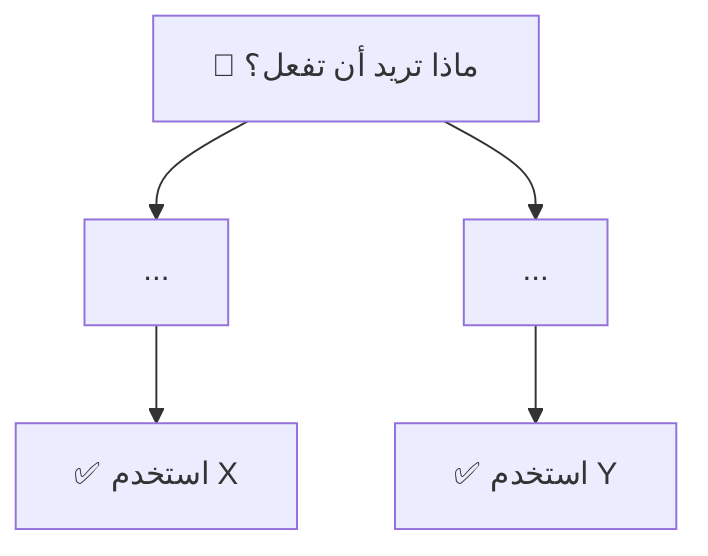

# 📚 قاعدة كتابة الشروحات التعليمية / Tutorial Writing Rule

> **الهدف:** توحيد أسلوب كتابة الشروحات التقنية لتكون مُنسقة، مفهومة، وقابلة للعرض بـ Preview المضمن في Antigravity.

---

## 1. 📦 بنية الملف وصيغته / File Structure & Format

### ⚠️ الحدود القصوى / Size Limits

> [!CAUTION]
> **حدود صارمة لكل ملف شرح:**
> - 📏 **الحد الأقصى للسطور:** `2500 سطر` لكل ملف
> - 💾 **الحد الأقصى للحجم:** `1 MB` (1,048,576 بايت) لكل ملف
> - إذا تجاوز المحتوى أياً من هذين الحدين → **قسّمه إلى أجزاء** (انظر قسم التقسيم أدناه)

### 📂 مجلد التخزين المخصص / Dedicated Storage Folder

> [!IMPORTANT]
> **جميع الشروحات التعليمية** يجب أن تُخزن في مجلد فرعي `tutorials/` داخل مجلد الـ Artifacts:
> ```
> brain/{conversation-id}/
> └── tutorials/
>     ├── {name}.md                    ← المحتوى الأساسي (Artifact)
>     ├── {name}.md.metadata.json      ← البيانات الوصفية
>     └── {name}.md.resolved           ← نسخة Preview
> ```
> هذا يسهّل تتبع الشروحات وفصلها عن التقارير والملفات الأخرى.

### الملفات المطلوبة عند إنشاء شرح:
| الملف | الغرض | المسار | مثال |
|-------|--------|--------|------|
| `{name}.md` | ✅ المحتوى الأساسي — يُكتب كـ Artifact | `tutorials/{name}.md` | `tutorials/nestjs-guards.md` |
| `{name}.md.metadata.json` | 📋 بيانات وصفية للـ Artifact | `tutorials/{name}.md.metadata.json` | `tutorials/nestjs-guards.md.metadata.json` |
| `{name}.md.resolved` | 🔄 النسخة النهائية القابلة للعرض بـ Preview | `tutorials/{name}.md.resolved` | `tutorials/nestjs-guards.md.resolved` |

### قواعد إنشاء الملفات:
- **أنشئ الملف الأساسي** بامتداد `.md` كـ Artifact مع `artifactType: "walkthrough"`
- **أنشئ ملف `.md.metadata.json`** يحتوي على:
  ```json
  {
    "artifactType": "ARTIFACT_TYPE_WALKTHROUGH",
    "summary": "ملخص شامل للمحتوى بلغتين...",
    "updatedAt": "ISO-8601 timestamp",
    "requestFeedback": true
  }
  ```
- **أنشئ ملف `.md.resolved`** بنفس محتوى `.md` — هذا هو الملف الذي يعمل عليه Preview

### 📐 استراتيجية التقسيم عند تجاوز الحدود / Splitting Strategy

إذا تجاوز الشرح **2500 سطر** أو **1 MB**، قسّمه كالتالي:

```
tutorials/
├── project-core-concepts/             ← مجلد فرعي للموضوع
│   ├── 00-index.md                    ← فهرس يربط جميع الأجزاء
│   ├── 00-index.md.metadata.json
│   ├── 00-index.md.resolved
│   ├── 01-basic-concepts.md           ← الجزء الأول
│   ├── 01-basic-concepts.md.metadata.json
│   ├── 01-basic-concepts.md.resolved
│   ├── 02-advanced-topics.md          ← الجزء الثاني
│   ├── 02-advanced-topics.md.metadata.json
│   ├── 02-advanced-topics.md.resolved
│   └── ...                            ← باقي الأجزاء
```

**ملف الفهرس (`00-index.md`) يجب أن يتضمن:**
- عنوان الشرح الكامل
- فهرس بروابط لجميع الأجزاء
- ملخص موجز لكل جزء
- عدد الأسطر الإجمالي لجميع الأجزاء

---

## 2. 🌍 التعامل مع تداخل اللغتين العربية والإنجليزية وفصل الأكواد / Bilingual Handling & Code Isolation

### أ. فصل الأكواد عن النصوص / Isolation of Code Blocks
- **يُمنع منعاً باتاً** كتابة كود برمجي طويل أو استدعاء دوال في نفس سطر النص العربي.
- يجب وضع أي كود برمجي أو مقارنة بين كودين في كتلة كود منفصلة (Fenced Code Block) مع تحديد لغة البرمجة (مثل `typescript` أو `sql` أو `json`).
- يُسمح فقط بكتابة أسماء المتغيرات والكلمات التقنية البسيطة جداً كـ `inline code` (مثل `x` أو `id`) بشرط ألا تؤثر على تدفق وسلاسة السطر العربي.

### ب. استخدام صناديق التنبيه الإلزامية / Mandatory Alert Boxes
يتم استخدام هذه الصناديق بشكل إلزامي في جميع الإجابات والشروحات التقنية لتصنيف المعلومات وتفادي فوضى التنسيق وتداخل النصوص ثنائية اللغة:

| نوع الصندوق / Box Type | الاستخدام التفصيلي (عام لكل اللغات والأنظمة) / Detailed Usage (General) |
| :--- | :--- |
| **`> [!NOTE]`** | **شرح فكرة عامة:** يُسخدم لشرح فكرة أو مفهوم عام، أو توضيح منطق عمل كود، أو إعطاء خلفية تاريخية/تقنية عن المشكلة البرمجية المطروحة. |
| **`> [!TIP]`** | **النصائح والتحسينات:** يُستخدم لعرض أفكار تحسين الأداء (Optimizations)، أو اقتراح أسلوب برمجي أفضل وأكثر نظافة (Refactoring)، أو تقديم نصائح عامة للمطور. |
| **`> [!IMPORTANT]`** | **المتطلبات الجوهرية:** يُسخدم لشرح التغييرات الجوهرية في المنطق البرمجي، أو تعديلات مخططات وقوالب قواعد البيانات (Database Schemas)، أو المعاملات الإجبارية التي لا يمكن تجاهلها. |
| **`> [!WARNING]`** | **الأخطاء البرمجية والعيوب:** يُستخدم للتنبيه لوجود أخطاء برمجية خفية (Bugs)، أو تحذيرات حول منطق الحسابات والمعاملات الحساسة، أو ديون تقنية (Technical Debt) في الكود الحالي. |
| **`> [!CAUTION]`** | **المخاطر والتعطيل البرمجي:** يُستخدم للتحذير من أخطاء وقت التشغيل (Runtime Errors)، أو الكود الذي قد يسبب تعطل النظام (Crashes)، أو كسر التوافقية مع الأنظمة والبروتوكولات السابقة (Breaking Changes). |

### ج. القواعد الأساسية للكتابة الثنائية / Basic Rules for Bilingual Writing:
- **العناوين:** يجب أن تكون ثنائية اللغة دائماً (عربي أولاً ثم إنجليزي) مثل: `## 🛡️ Guards — الحراس`
- **الفقرات:** عربي أولاً، ثم إنجليزي لضمان وضوح المحتوى لجميع مستويات المطورين.
- **التعليقات في الأكواد:** سطر عربي يليه سطر إنجليزي لشرح كل خطوة برمجية هامة.

**أمثلة عامة للتطبيق الصحيح للصناديق التنبيهية وفصل الأكواد:**

```markdown
> [!NOTE]
> **مفهوم حقن التبعيات (Dependency Injection):**
> هو نمط تصميم برمجي يسمح بفصل إنشاء الكائنات عن استخدامها، حيث يقوم محرك الإطار (Framework Container) بتوفير الخدمات والاعتمادات المطلوبة تلقائياً عند طلبها.

> [!TIP]
> **أفضل ممارسة لتحسين الأداء (Optimization):**
> يفضل استخدام الفهرسة (Database Indexing) على الحقول الأكثر بحثاً في الجداول لتقليل زمن استجابة الاستعلامات البرمجية.

> [!IMPORTANT]
> **تعديل جوهري في مخطط قاعدة البيانات (Schema Change):**
> تم تغيير نوع حقل المعرف الفرعي في جدول المستخدمين من عدد صحيح (Integer) إلى معرف فريد عالمي (UUID) لضمان عدم تكرار المعرفات عبر الخوادم المختلفة.

> [!WARNING]
> **تحذير من تسريب الذاكرة (Memory Leak Warning):**
> تأكد دائماً من إلغاء الاشتراكات النشطة (Unsubscribe) في تدفقات البيانات عند تدمير المكون البرمجي لتفادي استهلاك موارد الذاكرة بشكل مستمر.

> [!CAUTION]
> **تعديل يكسر التوافقية السابقة (Breaking Change):**
> حذف دالة التحقق القديمة `validateOld()` واستبدالها بالدالة الجديدة `validateSecure()`. أي استدعاء للدالة القديمة سيؤدي إلى فشل بناء المشروع (Build Crash) وقت التشغيل.
```

---


## 3. 📊 الرسوم التوضيحية / Diagrams (Mermaid)

### القاعدة: استخدم Mermaid لكل مفهوم يتضمن تدفقاً أو علاقات.

### الأنواع المطلوبة حسب السياق:

| نوع المخطط | متى يُستخدم | مثال |
|------------|------------|------|
| `graph LR` / `graph TD` | تدفق البيانات أو العلاقات | بنية المشروع |
| `sequenceDiagram` | تسلسل زمني بين أطراف | دورة حياة Request |
| `graph TD` مع `subgraph` | تصنيف وتجميع عناصر | العلاقات بين الطبقات والمكونات |

### قواعد الرسم:
- **استخدم أيقونات Emoji** في أسماء العقد: `A["🌐 Client Request"]`
- **لوّن العقد** بألوان مميزة عبر `style`:
  ```mermaid
  graph LR
      A["🌐 Request"] --> B["🚪 Middleware"]
      B --> C["🛡️ Guard"]
      style A fill:#3498db,color:#fff
      style B fill:#e67e22,color:#fff
      style C fill:#e74c3c,color:#fff
  ```
- **أضف ملاحظات** في الـ `sequenceDiagram` عبر `Note over`:
  ```mermaid
  sequenceDiagram
      participant C as 🌐 Client
      participant H as ⚙️ Handler
      C->>H: Request
      Note over H: ✅ تنفيذ المنطق
      H-->>C: Response
  ```
- **استخدم `subgraph`** للتصنيف:
  ```mermaid
  graph TD
      subgraph "المصادقة / Authentication"
          A["🔐 JWT Guard"]
          B["🛡️ Roles Guard"]
      end
  ```

---

## 4. 📖 مستوى الشرح / Explanation Level

### المستوى المستهدف: بين المبتدئ والمتوسط

- **ابدأ بتشبيه واقعي** (مثل: "الـ Guard أو الـ Filter مثل موظف الاستقبال أو حارس الأمن للبوابة")
- **ثم اشرح المفهوم التقني** بسهولة
- **ثم أعطِ الكود**
- **لا تفترض معرفة مسبقة** بالأنماط المتقدمة (مثل Reactive Programming أو Dependency Injection)

### هيكل شرح كل مفهوم:
```
1. ما هو [المفهوم]؟ — تعريف بسيط + تشبيه
2. كيف يعمل؟ — مخطط Mermaid
3. المثال المتكامل — كود كامل مع تعليقات
4. أنواعه (إن وُجدت) — جدول مقارنة
5. متى تستخدمه؟ — نصائح عملية
```

---

## 5. 📋 التوطئة للمفاهيم والمصطلحات / Terminology Introduction

### في بداية كل شرح، أنشئ قسماً للمستوى والمراجع:

```markdown
> **المستوى المستهدف:** مطور مبتدئ-متوسط يعرف أساسيات TypeScript
> **Target Level:** Beginner-Intermediate developer familiar with TypeScript basics
>
> **المصادر الرسمية / Official Sources:**
> - [رابط 1](URL) | [رابط 2](URL) | [رابط 3](URL)
```

### وأنشئ فهرس المحتويات:
```markdown
## 📑 فهرس المحتويات / Table of Contents
1. [الموضوع الأول](#الرابط)
2. [الموضوع الثاني](#الرابط)
```

### وعرّف كل مصطلح جديد عند أول ظهور:
```markdown
<!-- الـ IoC Container = نظام يُدير إنشاء وتوزيع الاعتمادات والكائنات تلقائياً -->
**IoC Container** (حاوية عكس التحكم): هو نظام برمجى يُنشئ الخدمات والاعتمادات
ويوزعها تلقائياً — المطور يُصرح باحتياجه للاعتماد فقط والنظام يتكفل بإنشائه وتمريره.
```

---

## 6. 🎨 الرموز والأيقونات / Icons & Emojis

### استخدم الأيقونات بثبات:
| الأيقونة | المعنى | الاستخدام |
|----------|--------|-----------|
| 🌐 | Client / Request | بداية الطلب |
| 🚪 | Middleware | وسيط |
| 🛡️ | Guard | حارس / صلاحيات |
| 🎯 | Interceptor | معترض |
| ⚙️ | Handler / Controller | المعالج |
| 📦 | Provider / Service | الخدمة |
| 🔐 | Authentication | مصادقة |
| 📝 | Validation / Pipes | تحقق |
| 📤 | Response | استجابة |
| ✅ | نجاح / صح | عملية ناجحة |
| ❌ | فشل / خطأ | عملية فاشلة |
| 🏗️ | بناء / Architecture | بنية |
| 💡 | نصيحة | TIP |
| ⚠️ | تحذير | WARNING |
| 🐌 | بطء في الأداء | Performance issue |
| 🗄️ | Database | قاعدة بيانات |
| 📁 | File/Module | ملف |

### استخدم الأيقونات لاستبدال الشرح عند الوضوح:
```markdown
✅ يعمل  |  ❌ لا يعمل  |  ⚠️ يعمل بشروط
```

---

## 7. 💻 أمثلة الكود / Code Examples

### كل مثال كود يجب أن يتضمن:

1. **مصدر الملف** كتعليق أول:
   ```typescript
   // 📁 users/users.service.ts
   ```

2. **الاعتماديات (imports)** كاملة:
   ```typescript
   import { Injectable, NotFoundException } from './common';
   ```

3. **تعليقات ثنائية اللغة** على كل خطوة مهمة:
   ```typescript
   // التحقق من وجود المستخدم — يرمي خطأ 404 إذا لم يُوجد
   // Check user existence — throws 404 if not found
   ```

4. **JSDoc عربي + إنجليزي** لكل دالة:
   ```typescript
   /**
    * البحث عن مستخدم بالمعرّف
    * Finds a user by their unique ID
    * @param id - معرّف المستخدم / The user's unique identifier
    * @returns بيانات المستخدم / User data
    */
   ```

5. **وظيفة الكود** واضحة — أضف تعليق فوق الـ class يوضح الغرض:
   ```typescript
   // هذا المكون يتحقق من صلاحيات المستخدم ودوره في النظام
   // This component verifies the user's role and authorization
   export class RolesGuard { ... }
   ```

6. **سيناريو واقعي** مرتبط بالمشروع:
   ```markdown
   **سيناريو:** نظام إدارة الحسابات والصلاحيات — يمنع غير المصرح لهم من تعديل البيانات الحساسة
   ```

---

## 8. 📊 الجداول / Tables

### استخدم الجداول في:

1. **المقارنة بين مفاهيم:**
   ```markdown
   | المفهوم | متى يعمل | الوظيفة | ExecutionContext | تشبيه |
   |---------|----------|---------|-----------------|-------|
   | Middleware / Filter | أولاً | تسجيل / فلترة أولية | ❌ | موظف استقبال |
   | Guard / Interceptor | ثانياً | صلاحيات ومعالجة متقدمة | ✅ | حارس أمن |
   ```

2. **توضيح الخيارات والأنماط:**
    ```markdown
    | النمط | متى تستخدمه | مثال |
    |-------|------------|------|
    | `Singleton` | كائن مشترك طوال حياة التطبيق | مدير الاتصال بقاعدة البيانات |
    | `Factory` | إنشاء كائنات ديناميكية | توليد رموز التحقق المشفرة |
    ```

3. **تلخيص الأوامر أو الـ API:**
    ```markdown
    | المنهجية | الوصف | المثال |
    |-------|-------|--------|
    | `GET` | طلب جلب البيانات | `GET /api/data` |
    ```

---

## 9. 📝 الملخص النهائي / Final Summary

### كل شرح يجب أن ينتهي بـ:

#### أ) جدول المقارنة النهائي:
```markdown
## 📊 جدول المقارنة النهائي / Final Comparison Table
| المفهوم | ... |
```

#### ب) مخطط "متى تستخدم ماذا":


#### ج) نصيحة ذهبية:
```markdown
> [!TIP]
> **نصيحة ذهبية / Golden Tip:**
> ابدأ دائماً بأبسط حل...
```

#### د) المراجع الرسمية:
```markdown
> **المراجع الرسمية / Official References:**
> - [الرابط 1](URL)
> - [الرابط 2](URL)
```

### مقالات مفيدة:
```markdown
- 📖 [Multi-Tenancy Best Practices](URL)
- 📖 [JWT Security Guide](URL)
```

#### هـ) اقتراحات للخطوة التالية:
```markdown
## 🚀 الخطوة التالية / Next Steps
- 📖 اقرأ عن [الموضوع التالي](URL)
- 🛠️ طبّق المثال في مشروعك
- 🧪 اكتب اختبارات للكود
```

---

## 📌 ملخص القاعدة / Rule Summary

> [!IMPORTANT]
> **القواعد الذهبية السبع لكتابة الشروحات:**
> 1. 🌍 **ثنائي اللغة** — عربي أولاً، إنجليزي ثانياً
> 2. 📊 **مرئي** — مخططات Mermaid لكل تدفق
> 3. 💻 **عملي** — أمثلة كود كاملة مع مصادرها
> 4. 📖 **متدرج** — تشبيه → شرح → كود → جدول
> 5. 📦 **مُنسق** — أيقونات وجداول وتنبيهات GitHub
> 6. 📏 **محدود** — لا يتجاوز 2500 سطر أو 1 MB لكل ملف
> 7. 📂 **منظم** — يُخزن في `tutorials/` مع تقسيم المحتوى الكبير